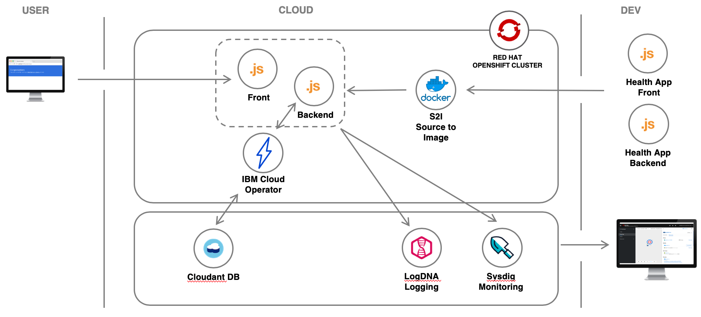

# Introduction

## OpenShift 201: Learn the integrations of Red Hat OpenShift on IBM Cloud

A recent study by McKinsey & Company reveals that only 20 percent of enterprise applications have moved to the cloud. We believe that a hybrid cloud approach, built on open source and a vibrant open ecosystem, is the best way to move the remaining 80 percent.

Red Hat OpenShift represents a common platform, based on the industry-standard Kubernetes, that allows you to build on premises, on the IBM Cloud, or on any other leading cloud platform. You want freedom of choice; Red Hat OpenShift offers exactly that.

The goals of this workshop are:

* To familiarize the studen with OpenShift on IBM Cloud
* To learn how to integrate OpenShift and IBM Cloud

## Architecture

1. A developer generates a starter application with IBM Cloud Developer Tools.
1. Building the application produces a Docker container image.
1. The image is pushed to a project in OpenShift cluster.
1. The application is deployed to a OpenShift cluster.
1. Users access the application.
1. A developer connects the application to a Cloudant database with Operator.
1. A developper monitors the app with LogDNA and Sysdig.

## Agenda

### Getting Started
* [Create account and get cluster](pre-work/get_started.md)
* [Access the cluster using the command line](pre-work/setup_cli.md)

### OpenShift and IBM Cloud
* [Cloudant DB with IBM Cloud Operator](exercise-01/readme.md)
* [Configure the Sysdig Agent](exercise-02/readme.md)
* [Configure the LogDNA Agent](exercise-03/readme.md)
* [Analyze your logs with LogDNA](exercise-04/readme.md)
* [Monitor your Cluster with SysDig](exercise-05/readme.md)

## Compatibility

This workshop has been tested on the following platforms:

* **macOS**: Mojave \(10.14\), Catalina \(10.15\), Chrome \(79.x\)

## Credits

Many folks have contributed to help shape, test, and contribute the workshop.

* [Spencer Krum](https://github.com/nibalizer)
* [JJ Asghar](https://github.com/jjasghar)
* [Tim Robinson](https://github.com/timroster)
* [Mofi Rahman](https://github.com/moficodes)
* [Sai Vennam](https://github.com/svennam92)
* [Steve Martinelli](https://github.com/stevemar)
* [Ram Vennam](https://github.com/rvennam)
* [Remko De Knikker](https://github.com/remkohdev)
* [Alex Parker](https://github.com/ajp-io)
* [Lionel Mace](https://github.com/lionelmace)
* [Marisa Lopez de Silanes Ruiz](https://github.com/lopezdsr)
